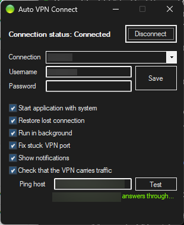
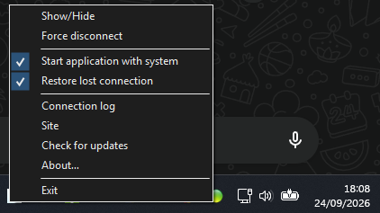

# Auto VPN Connect
[](https://github.com/germain-italic/autoVPNConnect/releases/latest)


AutoVPNConnect is free software that reconnects your VPN automatically when it drops.

This repository is a fork of [sergiye/autoVPNConnect](https://github.com/sergiye/autoVPNConnect)
by Sergiy Egoshyn, maintained by [germain-italic](https://github.com/germain-italic)
independently of the original project.

----

## Features

### What can it do?

 - Reconnect with saved user/password (by rasdial command).
 - Reconnect without saved user/password by rasphone command (The VPN connection dialog box will be displayed.)
 - Recover from RAS error 633 (`the specified port is already open`) by restarting the RasMan service, see below.
 - Runs as background application with tray icon.
 - `Light` / `Dark` themes with `Auto` mode to switch when changing system settings
 - No installation required, just save the executable file anywhere on your computer and run it.
 

### Fix stuck VPN port (RAS error 633)

After a VPN session drops, Windows sometimes keeps the WAN Miniport port marked as in use.
Every later dial then fails with `Error 633: The port is already open`, and no amount of
retrying helps - the RasMan service has to be restarted before the port is released. Left
alone, this silently defeats auto reconnect until someone notices and fixes it by hand.

With **Fix stuck VPN port** enabled (the default), a dial that fails with 633 first hangs up
the session left over from the dropped connection and retries; if the port is still held, it
restarts RasMan and retries once more.

This recovery applies to connections dialed through the RAS API with usable saved
credentials. When credentials are unavailable, the application opens the Windows
`rasphone` connection dialog; it cannot apply this recovery to errors inside that dialog.
Restarting RasMan affects the whole machine and can disconnect other active VPN or
dial-up connections, not just the configured VPN.

Restarting a service needs administrator rights, so the application registers a scheduled
task, `AutoVPNConnect\RestartRasMan`, that performs the restart. It is registered the first
time you open the main window (or when you tick the option), never in the background while a
reconnect is failing - that is the only UAC prompt, and the task is triggered silently
afterwards, which is what keeps unattended reconnects working while the app sits in the tray.
Because `schtasks /Run` only reports that the task was queued, the outcome is read back from
the Task Scheduler itself - a restart that never ran would otherwise pass for a successful one.

If the application already runs elevated, no task is created and the service is restarted
directly, stopping and restoring any dependent services.

The task carries the version of the script it was created with, so a later release that
changes what the task does replaces it instead of leaving the old one in place. That costs
one further UAC prompt, once, the first time you open the window after such an update; if you
decline it, the existing task keeps working as before.

Unticking the option offers to remove the task. It can also be removed by hand:

```
schtasks /Delete /TN "AutoVPNConnect\RestartRasMan" /F
```

### UI example 

Main app window:

[](preview.png)

Extended app system menu:

[](sysMenu.png)

System tray integration with menu:

[](sysTray.png)

## Download

Builds of this fork are published on its
[releases](https://github.com/germain-italic/autoVPNConnect/releases) page. The in-app *Site*
and *Check for updates* entries point to this fork, not to the original project.

## Why this fork

The original source builds, but the resulting executable cannot start. Two separate causes:

 - `SergiyE.Common` and `SergiyE.Common.UI`, the original author's NuGet packages, resolve to
   version 1.0.9745, which is published as a stub: 470 methods of `SergiyE.Common` throw
   `NotImplementedException`, including the first one called at startup.
 - `Costura.Fody` 4.1.0, when the project is built with `dotnet build`, weaves references to
   .NET 8 (`System.Private.CoreLib 8.0`) into an executable that runs on .NET Framework 4.7.2.
   It fails before `Main` with a `FileNotFoundException`.

The first problem was reported upstream in
[issue #2](https://github.com/sergiye/autoVPNConnect/issues/2). It was closed as not planned,
with this reply from the maintainer:

> Your AI wasted my time having me read a long generated report that asked me to spend even
> more time modifying the project just to make it easier for the AI to work with.
> Don't do that.
> If you have complaints about how the program is working, describe them yourself.
> Clearly and concisely.
> Respect other people's time.

Changes made in this fork are therefore not offered upstream.

## What this fork changes

 - **Runs again.** Both packages are pinned to 1.0.9500, the last version with real method
   bodies, and `Costura.Fody` is upgraded to 5.7.0. The OS compatibility check, absent from
   1.0.9500, is dropped.
 - **TLS validation restored.** The updater in `SergiyE.Common` installs a process-wide
   certificate callback that accepts any certificate, then downloads and runs a replacement
   executable. The callback is removed at startup.
 - **RAS error 633 recovery**, described above.
 - **Settings fields load once**, so a network change no longer duplicates the VPN entry or
   overwrites a user name being typed.
 - **Links, update check and About box** point to this fork.

## Contributing

Issues and pull requests are welcome on
[this fork](https://github.com/germain-italic/autoVPNConnect/issues).

### Building and validating changes

On Windows, with a .NET SDK and the .NET Framework 4.7.2 targeting pack:

```powershell
dotnet build -c Release
```

The executable is written to `AutoVPNConnect/bin/`. `make.bat` builds through Visual Studio's
MSBuild instead, when Visual Studio is installed.

The error 633 mechanisms can be checked on their own:

```powershell
powershell.exe -NoProfile -ExecutionPolicy Bypass -File tests/RecoveryChecks/Run.ps1
```

See [the recovery checks](tests/RecoveryChecks/README.md) for prerequisites, coverage and
limits. These checks use an invalid RAS handle, simulated service commands and temporary
tasks with harmless actions. They never restart RasMan or run the application's recovery
task. Passing them verifies isolated mechanisms, not a complete VPN reconnection or the UI.

## License

The original code carries no license. It remains Copyright © 2014 Sergiy Egoshyn, all rights
reserved, and is published here under GitHub's terms of service, which allow viewing and
forking it on GitHub.

Changes made in this fork are licensed under the GNU General Public License v3.0, the
license of the `SergiyE.Common` packages embedded in the executable. See [LICENSE](LICENSE).
